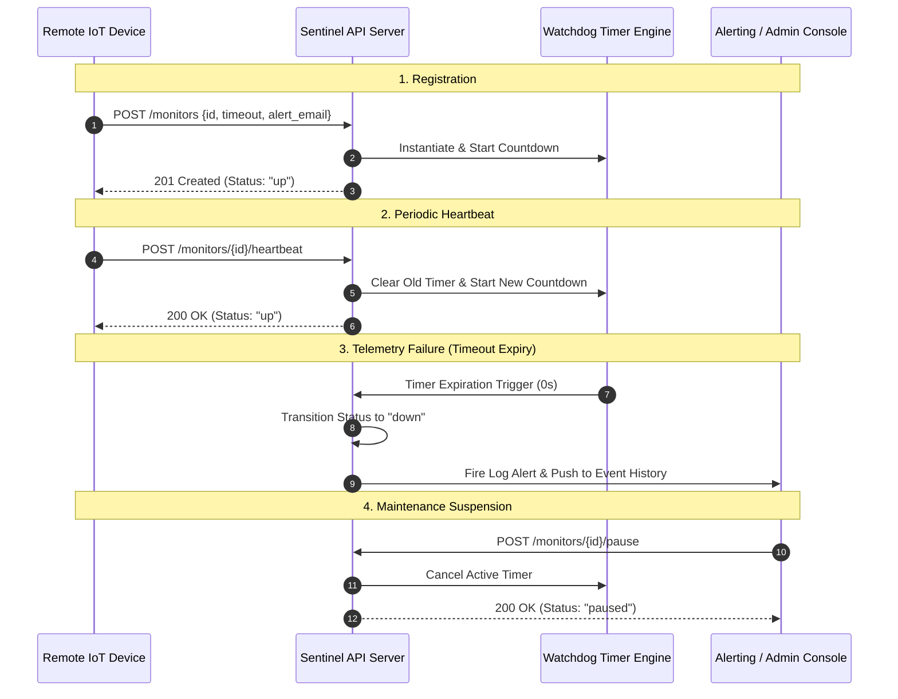

# 🛰️ Pulse-Check-API ("Watchdog" Sentinel)

[](https://nodejs.org/)
[](https://expressjs.com/)
[](https://developer.mozilla.org/en-US/docs/Web/JavaScript)
[](LICENSE)
[]()

> A robust, high-performance **Dead Man's Switch RESTful API** designed for **CritMon Servers Inc.** to monitor remote IoT infrastructure, solar farms, and weather stations. The sentinel tracks periodic "I'm alive" heartbeats from remote units and triggers immediate alert notifications upon telemetry failure.

---

## 📋 Table of Contents
- [Architecture Overview](#-architecture-overview)
- [Key Features](#-key-features)
- [State Machine](#-state-machine)
- [Project Structure](#-project-structure)
- [Getting Started](#-getting-started)
  - [Prerequisites](#prerequisites)
  - [Installation](#installation)
  - [Running the Server](#running-the-server)
- [API Reference](#-api-reference)
- [Audit History & Event Logging](#-audit-history--event-logging)
- [Future Roadmap & Scalability](#-future-roadmap--scalability)

---

## 🏗️ Architecture Overview

The system operates as an asynchronous stateful sentinel. Each registered device maintains an independent countdown timer managed via Node.js runtime primitives.



---

## ✨ Key Features

- ⏱️ **Dead Man's Switch Core Engine**: Automatic timeout execution that flags unresponsive nodes as `down` when ping windows elapse.
- 💓 **Auto-Resuming Heartbeats**: Sending a heartbeat ping resets the timeout window and automatically transitions paused or recovered devices back to `up`.
- 🛠️ **Maintenance Mode (Pause)**: Suspend countdown timers on-demand during scheduled maintenance without triggering false positive alerts.
- 📜 **Full Event Audit Timeline**: Standardized history tracking (`CREATED`, `HEARTBEAT`, `PAUSED`, `ALERT`) for Root Cause Analysis (RCA).
- ⚡ **O(1) Data Store Lookup**: In-memory JavaScript `Map` data structure optimized for ultra-low latency heartbeat processing.
- 🧱 **Clean Modular Architecture**: Separation of concerns using a decoupled Service-Controller-Route pattern.

---

## 🔄 State Machine

Each monitor transitions strictly between three operational states:

| State | Indicator | Description |
| :--- | :---: | :--- |
| **`up`** | 🟢 | Device is actively sending heartbeats within its defined timeout window. |
| **`down`** | 🔴 | Watchdog countdown expired before a heartbeat arrived. Alert dispatched. |
| **`paused`** | 🟡 | Monitoring is manually suspended for routine maintenance or repair. |

---

## 📂 Project Structure

```text
pulse-check-api/
├── src/
│   ├── server.js            # Main application entry point & Express setup
│   ├── routes/              # Route handlers & HTTP endpoint definitions
│   │   └── monitorRoutes.js
│   ├── controllers/         # Request validation & HTTP response orchestration
│   │   └── monitorController.js
│   ├── services/            # Core business logic (Timers, State Machine, History)
│   │   └── monitorService.js
│   ├── data/                # In-memory Map data store
│   │   └── monitors.js
│   └── utils/               # Alert dispatching & audit logger
│       └── logger.js
├── PROJECT_DETAILS.md       # Exhaustive technical deep-dive documentation
├── package.json             # Node.js dependencies & script definitions
└── README.md                # Project documentation
```

---

## 🚀 Getting Started

### Prerequisites

- **Node.js** (`v14.0.0` or higher)
- **npm** (`v6.0.0` or higher)

### Installation

1. **Clone the repository**:
   ```bash
   git clone https://github.com/Syber-Tek/building_an_api.git
   cd pulse-check-api
   ```

2. **Install dependencies**:
   ```bash
   npm install
   ```

### Running the Server

- **Production Mode**:
  ```bash
  npm start
  ```
- **Development Mode** (with auto-reload via `nodemon`):
  ```bash
  npm run dev
  ```

*The API will start listening on port `5000` by default (`http://localhost:5000`).*

---

## 📡 API Reference

### Base URL
```http
http://localhost:5000
```

### Endpoints Overview

| Method | Endpoint | Description |
| :--- | :--- | :--- |
| `GET` | `/` | Health check route to verify server status. |
| `POST` | `/monitors` | Register a new watchdog monitor. |
| `POST` | `/monitors/:id/heartbeat` | Send a heartbeat ping to reset countdown timer. |
| `POST` | `/monitors/:id/pause` | Pause watchdog timer for maintenance. |
| `GET` | `/monitors` | Fetch all registered monitors and their history timelines. |

---

### Request / Response Examples

#### 1. Register a New Monitor
- **Endpoint**: `POST /monitors`
- **Request Body**:
  ```json
  {
    "id": "solar-panel-01",
    "timeout": 60,
    "alert_email": "ops@critmon.com"
  }
  ```
- **Response**: `201 Created`
  ```json
  {
    "message": "Monitor created successfully",
    "monitor": {
      "id": "solar-panel-01",
      "timeout": 60,
      "alert_email": "ops@critmon.com",
      "status": "up",
      "paused": false,
      "lastHeartbeat": "2026-09-07T21:30:00.000Z",
      "history": [
        {
          "type": "CREATED",
          "time": "2026-09-07T21:30:00.000Z"
        }
      ]
    }
  }
  ```

#### 2. Send Device Heartbeat
- **Endpoint**: `POST /monitors/:id/heartbeat`
- **Response**: `200 OK`
  ```json
  {
    "message": "Heartbeat received",
    "monitor": {
      "id": "solar-panel-01",
      "timeout": 60,
      "alert_email": "ops@critmon.com",
      "status": "up",
      "paused": false,
      "lastHeartbeat": "2026-09-07T21:30:45.000Z",
      "history": [
        { "type": "CREATED", "time": "2026-09-07T21:30:00.000Z" },
        { "type": "HEARTBEAT", "time": "2026-09-07T21:30:45.000Z" }
      ]
    }
  }
  ```

#### 3. Pause Monitor (Maintenance)
- **Endpoint**: `POST /monitors/:id/pause`
- **Response**: `200 OK`
  ```json
  {
    "message": "Monitor paused successfully",
    "monitor": {
      "id": "solar-panel-01",
      "status": "paused",
      "paused": true
    }
  }
  ```

#### 4. List All Monitors
- **Endpoint**: `GET /monitors`
- **Response**: `200 OK`
  ```json
  [
    {
      "id": "solar-panel-01",
      "timeout": 60,
      "alert_email": "ops@critmon.com",
      "status": "up",
      "paused": false,
      "lastHeartbeat": "2026-09-07T21:30:45.000Z",
      "history": [...]
    }
  ]
  ```

---

## 🌟 Audit History & Event Logging

Observability is essential for mission-critical hardware monitoring. Every monitor tracks complete state transitions over time in its `history` array.

### Event Types Logged:
1. `CREATED`: Initial node watchdog registration.
2. `HEARTBEAT`: Successful pulse reset received from hardware.
3. `PAUSED`: Manual suspension initialized by network operations center.
4. `ALERT`: Watchdog timeout expiration indicating connectivity loss.

### RCA Benefits:
- **Flapping Detection**: Identify nodes repeatedly switching between `up` and `down`.
- **Maintenance Compliance**: Verify whether outages aligned with authorized maintenance windows (`PAUSED`).
- **Reliability Metrics**: Compute uptime SLAs directly from historic heartbeat delta timestamps.

---

## ⚡ Scalability & Future Architecture

While the current implementation uses Node.js in-memory Map storage for microsecond lookup speeds, the decoupled architecture supports seamless production scaling:

- **Distributed Timers**: Replace local `setTimeout` with **Redis Key Expiration Events** (keyspace notifications) for multi-node horizontally scaled deployments.
- **Persistent Storage**: Swap memory data adapter with **PostgreSQL** or **MongoDB** for long-term historical analytical query capabilities.
- **Webhook Integration**: Extend `logAlert` to send automated webhooks to **PagerDuty**, **Slack**, **Opsgenie**, or SMS gateways (Twilio).

---

## 📄 License

This project is licensed under the **ISC License**.
